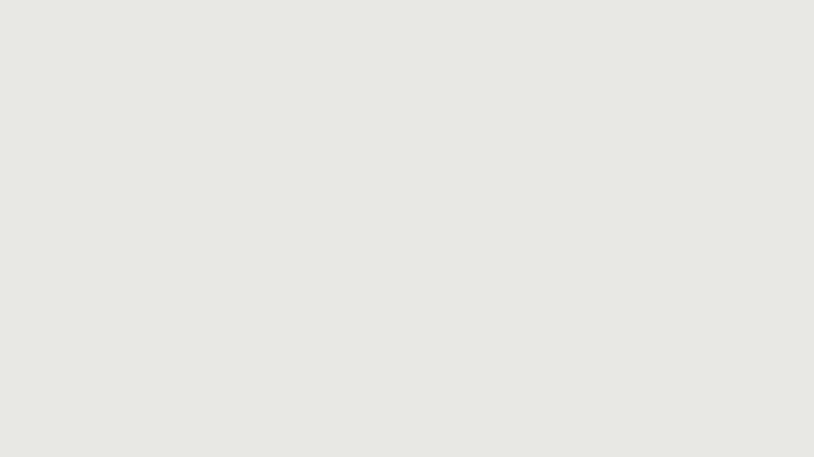

# Assets Offloader

Keep vault notes light by uploading attachments (images, video, audio, PDF, zip, and other whitelist types) to **your** S3-compatible bucket, rewriting note links to public URLs, and downloading those files back when you want them local again.

Works on desktop and mobile. Needs **Obsidian 1.13.0+** (settings search + Secret Storage). Access keys are never written to `data.json`.

Cloudflare R2 is the documented target. Other S3-compatible providers work if you fill endpoint, bucket, region, and a public URL base.

## Setup

1. Create a bucket and a public origin (custom domain or provider public URL). That origin is **Public URL base** in the plugin — no trailing slash.
2. Create API keys with object list, read, write, and delete.
3. In Obsidian, open **Settings → Assets Offloader**.
4. Paste a bucket URL into **Bucket URL** and select **Guess from URL**, or fill **Endpoint**, **Bucket**, and **Region** by hand.
5. Set **Public URL base** to the public origin from step 1.
6. Pick **Access key** and **Secret key** in Secret Storage (do not paste them into plain settings text).
7. Select **Test connection**. You should see a success notice.



R2 field-by-field (endpoint host, CORS, token): [docs/r2-setup.md](./docs/r2-setup.md).

## How to use

**Upload.** Open a markdown note that embeds local files (`![[photo.png]]` or ``). Run **Upload current note's local assets**. Matching whitelist files go to `{prefix}/{YYYYMM}/{name}` in the bucket, and the note links become markdown URLs under **Public URL base**. **Upload current folder's local assets** does the same for every note in the current folder (not recursive).


**Optional delete.** If **Delete local file after successful upload** is on, the plugin trashes the local file only after PUT succeeds and the note was rewritten, and only if nothing else still links to that file.

**Localize.** Run **Localize current note's assets** (or the folder command) to download remote files using Obsidian’s attachment folder rules and rewrite links back to local paths.


**Gallery.** The ribbon (or **Open remote asset gallery**) lists objects in the bucket by month. Open a file to preview it, insert a link, or download it into the vault.


**Convert links.** The convert commands only change wikilink vs markdown syntax. They do not upload or download. Markdown→wiki leaves `http(s)` links alone.

## Network use

This plugin makes **no calls to a vendor we operate**. There is no telemetry, analytics, or auto-update channel. Every request is one you opt into by configuring a bucket and running a command or opening the gallery.

| Remote host                                                                       | Why                                                                                                                                                                                            |
| --------------------------------------------------------------------------------- | ---------------------------------------------------------------------------------------------------------------------------------------------------------------------------------------------- |
| **S3 API endpoint** you set (e.g. `https://<accountid>.r2.cloudflarestorage.com`) | Signed HTTPS `list` / `put` / `get` / `delete` / `head` so the plugin can upload, list the gallery, download objects, and run **Test connection**. Access key and secret go only to this host. |
| **Public URL base** you set (e.g. `https://cdn.example.com`)                      | Unsigned HTTPS GET so localize can pull file bytes, and so the gallery / note preview can display images, video, and audio.                                                                    |

**Test connection** overwrites a small probe object under `.assets-offloader/` in the bucket. It does not delete.

If gallery thumbnails or in-note media fail to load, the **Public URL base** host needs CORS that allows GET from Obsidian (desktop is often `app://obsidian.md`).

## Vault files

Local reads and writes stay **inside the vault**: markdown, attachments, and Obsidian’s trash (when delete-after-upload is on). The plugin does not read or write files on disk outside the vault. Remote objects live in your bucket, not on your machine, until you localize them.

## Commands

| Command                                          | What it does                       |
| ------------------------------------------------ | ---------------------------------- |
| Upload current note's local assets               | Upload and rewrite links           |
| Upload current folder's local assets             | Same, every note in the folder     |
| Localize current note's assets                   | Download remotes into the vault    |
| Localize current folder's remote assets          | Same, folder, not recursive        |
| Convert current note wikilinks to markdown links | Syntax only                        |
| Convert current note markdown links to wikilinks | Internal links only; leave http(s) |
| Open remote asset gallery                        | Same as the ribbon                 |

## Development

- [Codebase map](./docs/architecture.md)
- [Contributing](./docs/contributing.md)
- [Releasing](./docs/releasing.md)

```bash
npm i
npm run dev
```

Copy `main.js`, `manifest.json`, and `styles.css` into `<Vault>/.obsidian/plugins/obsidian-assets-offloader/`, then reload Obsidian.

## License

[MIT](./LICENSE)
