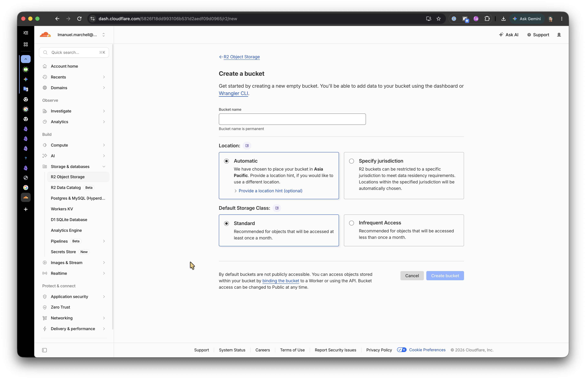
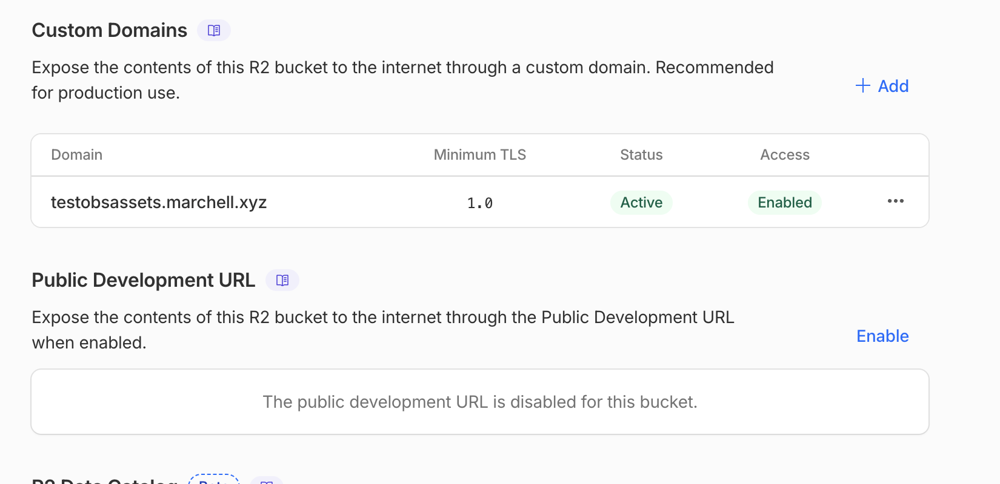

# Cloudflare R2 setup

## 1. Create an R2 bucket

1. Open the Cloudflare dashboard → **R2**.
2. Create a bucket (remember the name).



## 2. Public access / custom domain

This URL becomes **Public URL base** in the plugin (no trailing slash).

1. Enable a public custom domain or r2.dev public URL for the bucket.
2. Copy the origin, e.g. `https://cdn.example.com`.



## 3. API token

1. Create an R2 API token with object read / write / list / delete.
2. Save the **Access Key ID** and **Secret Access Key**.
3. Store them in Obsidian Secret Storage when the plugin asks (never paste into plain settings text).

## 4. Endpoint URL

```
https://<accountid>.r2.cloudflarestorage.com
```

## 5. Paste into Assets Offloader

1. Open **Settings → Assets Offloader**.
2. Paste the S3 bucket URL into **Bucket URL** → **Guess from URL**, or fill endpoint / bucket / region by hand.
3. Set **Public URL base** to the CDN / public origin from step 2.
4. Pick access key and secret key in Secret Storage.

## 6. Test connection

Hit **Test connection**. Expect a success notice.

## 7. Upload one image

1. Put a whitelist image in a test note (`![[photo.png]]` or markdown).
2. Run **Upload current note's local assets**.
3. Confirm the link became ``.


